<div align='center'>
  <h1>Algorithm</h1>
</div>

**Graph Algorithm**
- [Depth First Search](#depth-first-search)

**Sort Algorithm**
- [Quicksort](#quicksort)
- [Merge Sort](#merge-sort)
- [Heap Sort](#heap-sort)
- [Counting Sort](#counting-sort)
- [Radix Sort](#radix-sort)
- [Topological Sort](#topological-sort)
- [Reference](#reference)

------

## Depth First Search
- [파이썬 구현](./graph/dfs.py)  
- **그래프 순회**란 그래프 탐색이라고도 불리며 그래프의 각 정점을 방문하는 과정을 말한다.
- 각 정점을 방문하는 그래프 순회에는 크게 **깊이 우선 탐색**과 **너비 우선 탐색**의 2가지 알고리즘이 있다. DFS는 주로 스택으로 구현하거나 재귀로 구현하며, **백트래킹**을 통해 뛰어난 효용을 보인다. 
- **깊이 우선 탐색**은 맹목적 탐색방법의 하나로 트리나 그래프에서 한 루트로 탐색하다가 특정 상황에서 최대한 깊숙히 들어가서 확인한 뒤 다시 돌아가 다른 루트로 탐색하는 방식이다.
- **단순 검색 속도** 자체는 BFS에 비해서 느리다. 하지만 검색이 아닌 순회(traversal)를 할 경우는 많이 쓰인다. DFS는 특히 리프 노드에만 데이터를 저장하는 정렬 트리 구조에서 항상 순서대로 데이터를 방문한다는 장점이 있다. 백트래킹에 사용되는 이유도 공통 상위를 가지는 아래 리프 노드들을 한방에 잘라내 버리는게 가능하기 때문이다.
- **알고리즘**
    - **재귀를 이용한 DFS 구현 PseudoCode**
    ```
    DFS(G, v)
      label v as discovered
      for all directed edges from v to w that are in G.adjacentEdges(v) do
        if vertex w is not labeled as discovered then
          recursively call DFS(G, w)
    ```

- **시각화**

<div align='center'>
    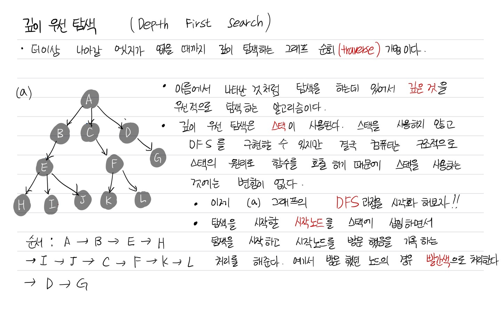
    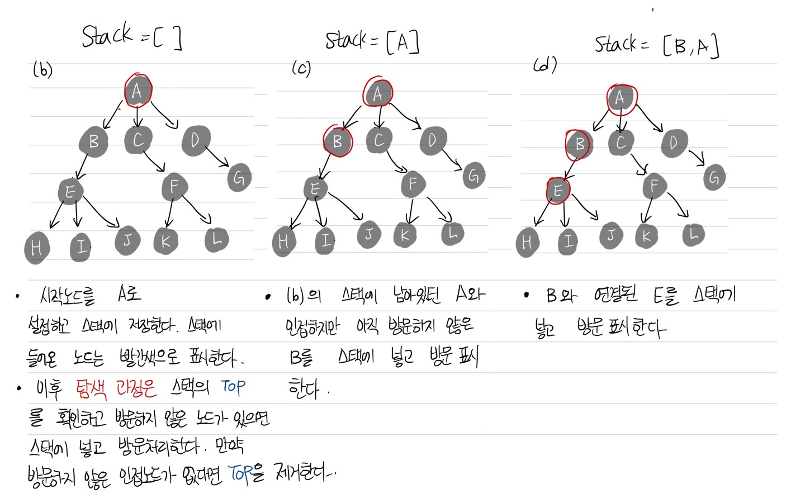
    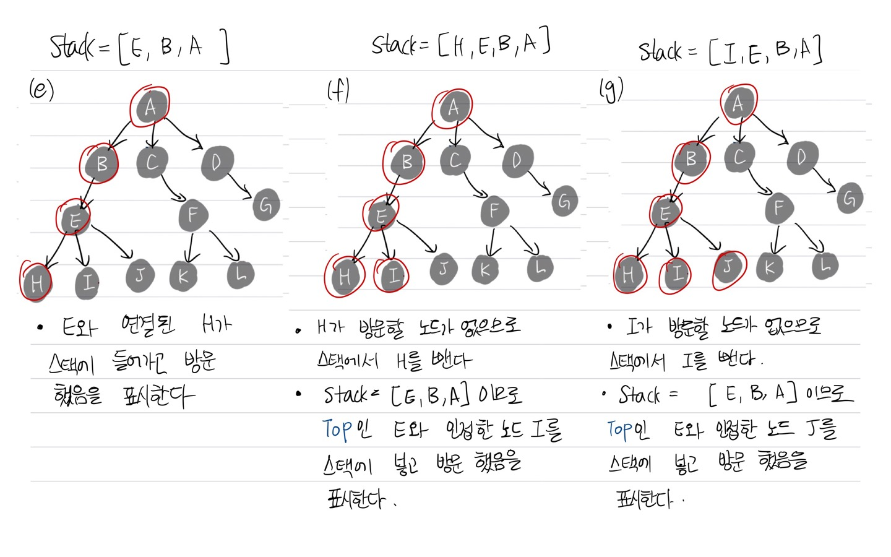
    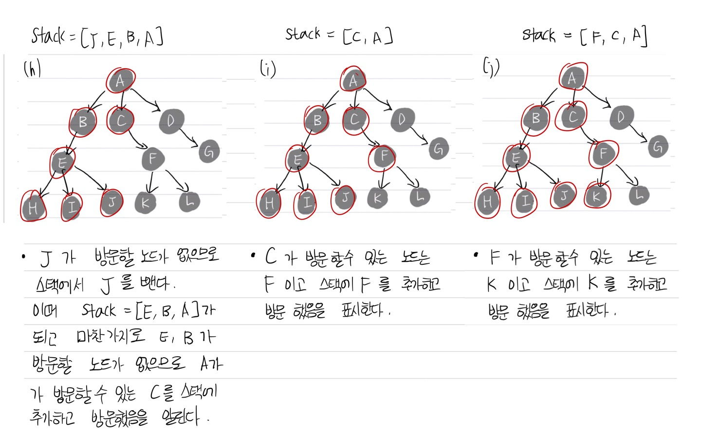
    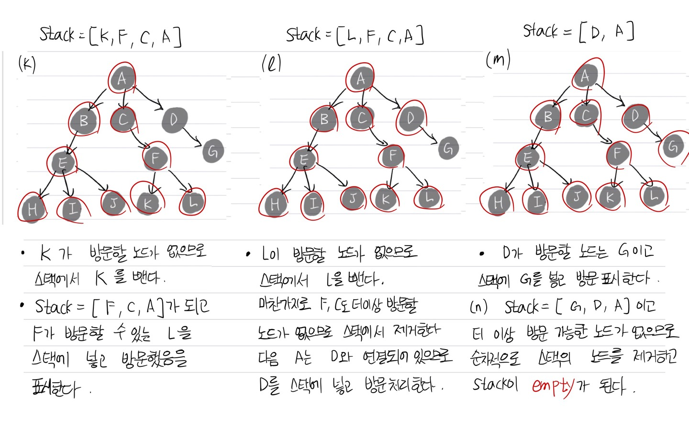
</div>
<br>

---
## Quicksort
- [파이썬구현](./sorting/quick_sort.py)
- **퀵 정렬**(Quick sort)은 다른 원소와의 비교를 통해 데이터를 정렬하는 **비교 알고리즘**으로 **피벗**을 가지는 것이 특징이며 n개의 데이터를 정렬할 때, 어떤 피벗을 선택하는지에 따라 최악의 경우에는 O(n2)번의 비교를 수행하고, 평균적으로 O(n log n)번의 비교를 수행한다. 
- **퀵정렬라고 불리는 이유는 무엇일까?**
  - 퀵 정렬의 내부 루프는 대부분의 컴퓨터 아키텍처에서 효율적으로 작동하도록 설계되어 있고(메모리 참조가 지역화되어 있기 때문에 CPU 캐시의 히트율이 높아지기 때문이다.), 대부분의 실질적인 데이터를 정렬할 때 제곱 시간이 걸릴 확률이 거의 없도록 알고리즘을 설계하는 것이 가능하다. 또한 매 단계에서 적어도 1개의 원소가 자기 자리를 찾게 되므로 이후 정렬할 개수가 줄어든다. 때문에 일반적인 경우 퀵 정렬은 다른 O(n log n) 알고리즘에 비해 훨씬 빠르게 동작한다.
  - 원소들 중에 같은 값이 있는 경우 같은 값들의 정렬 이후 순서가 초기 순서와 달라질 수 있어 **불안정 정렬**에 속한다.
- **알고리즘**
    ```
    퀵 정렬은 분할 정복(divide and conquer) 방법을 통해 리스트를 정렬한다.
    1. 리스트 가운데서 하나의 원소를 고른다. 이렇게 고른 원소를 피벗이라고 한다.
    2. 피벗 앞에는 피벗보다 값이 작은 모든 원소들이 오고, 피벗 뒤에는 피벗보다 값이 큰 모든 원소들이 오도록 피벗을 기준으로 리스트를 둘로 나눈다. 이렇게 리스트를 둘로 나누는 것을 분할이라고 한다. 
    3. 분할을 마친 뒤에 피벗은 더 이상 움직이지 않는다.
    4. 분할된 두 개의 작은 리스트에 대해 재귀(Recursion)적으로 이 과정을 반복한다. 재귀는 리스트의 크기가 0이나 1이 될 때까지 반복된다.
    5. 재귀 호출이 한번 진행될 때마다 최소한 하나의 원소는 최종적으로 위치가 정해지므로, 이 알고리즘은 반드시 끝난다는 것을 보장할 수 있다.
    ```
- **복잡도**
    ```
    최악 시간복잡도: O(n2)
    최선 시간복잡도: O(n log n)
    평균 시간복잡도: O(n log n)
    ```
- **시각화**

<div align='center'>
    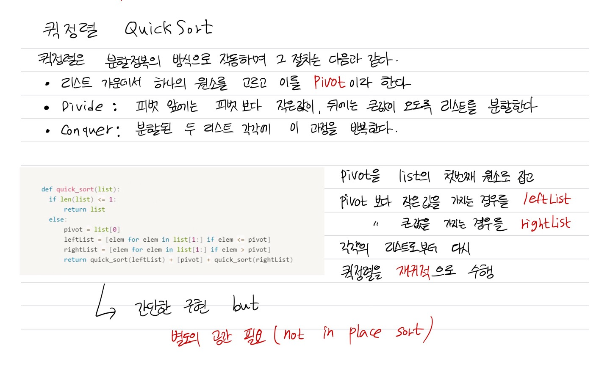
    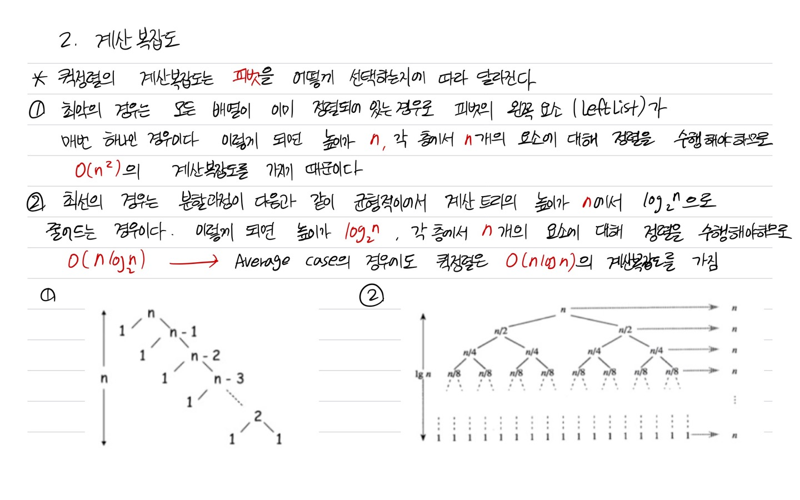
    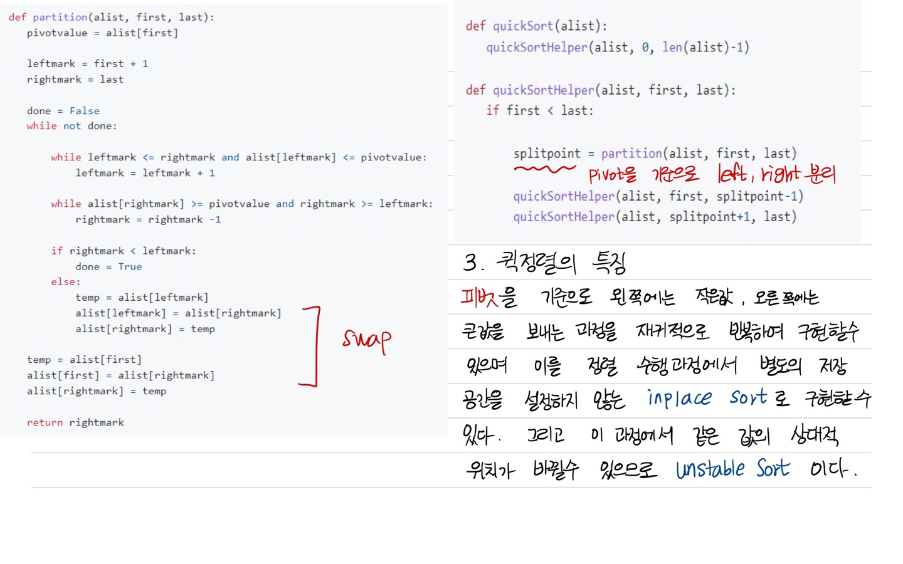
</div>
<br>

## Merge Sort
- [파이썬구현](./sorting/merge_sort.py)
- **합병 정렬**(merge sort)은 **O(n log n)** 비교 기반 정렬 알고리즘이다. 일반적인 방법으로 구현했을 때 이 정렬은 **안정 정렬**에 속하며, 분할 정복 알고리즘의 하나이다.
- **알고리즘**
    ```markdown
    하향식 2-way 합병 정렬 동작 과정
    
    리스트의 길이가 1 이하이면 이미 정렬된 것으로 본다. 그렇지 않은 경우에는
    분할(divide) : 정렬되지 않은 리스트를 절반으로 잘라 비슷한 크기의 두 부분 리스트로 나눈다.
    정복(conquer) : 각 부분 리스트를 재귀적으로 합병 정렬을 이용해 정렬한다.
    결합(combine) : 두 부분 리스트를 다시 하나의 정렬된 리스트로 합병한다. 이때 정렬 결과가 임시배열에 저장된다.
    복사(copy) : 임시 배열에 저장된 결과를 원래 배열에 복사한다.
    ```
- **복잡도**
   ```
   - 최악 시간복잡도: O(n log n)
   - 최선 시간복잡도: O(n log n)
   - 평균 시간복잡도: 일반적으로 O(n log n)
   - 공간복잡도: О(n)
   ```
- **시각화** 
<br>

<div align='center'>
    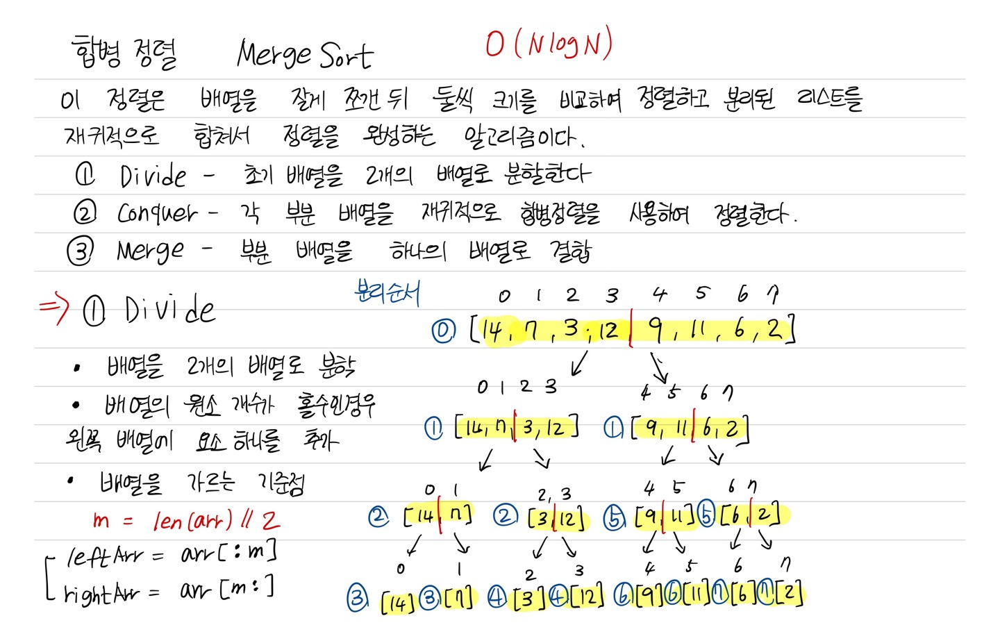
    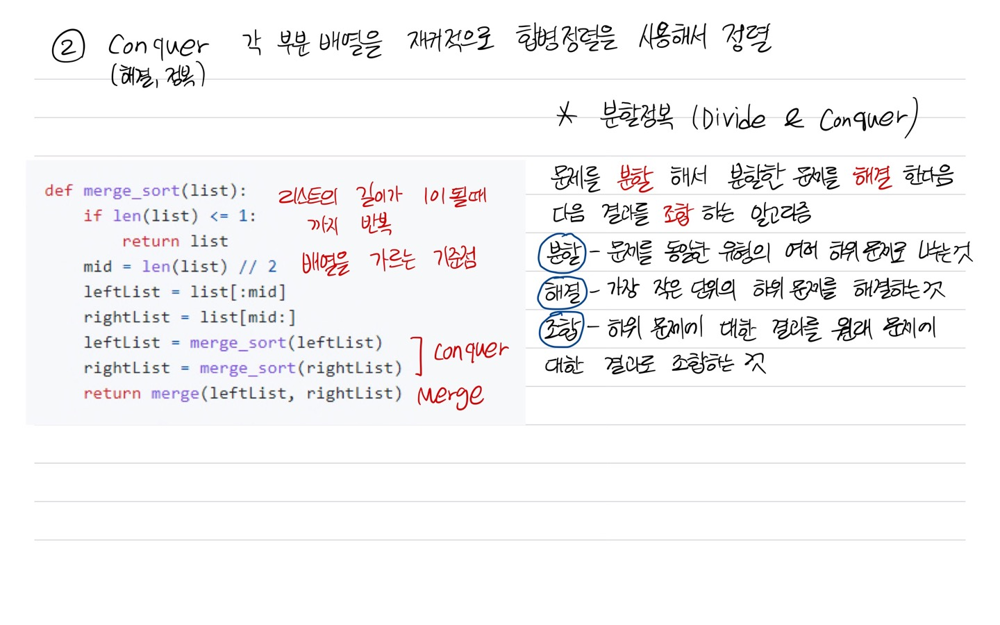
    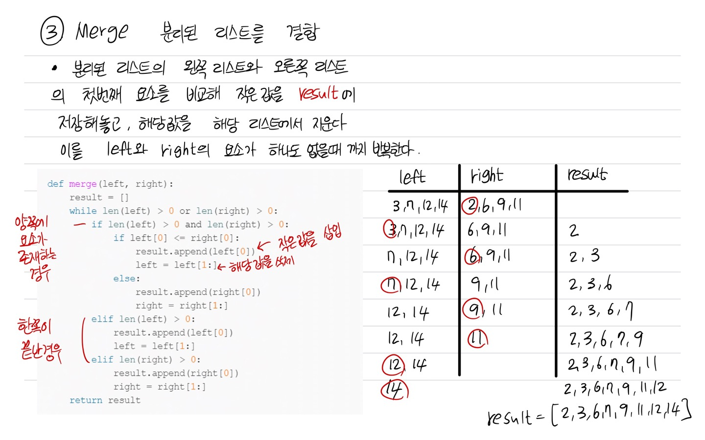
    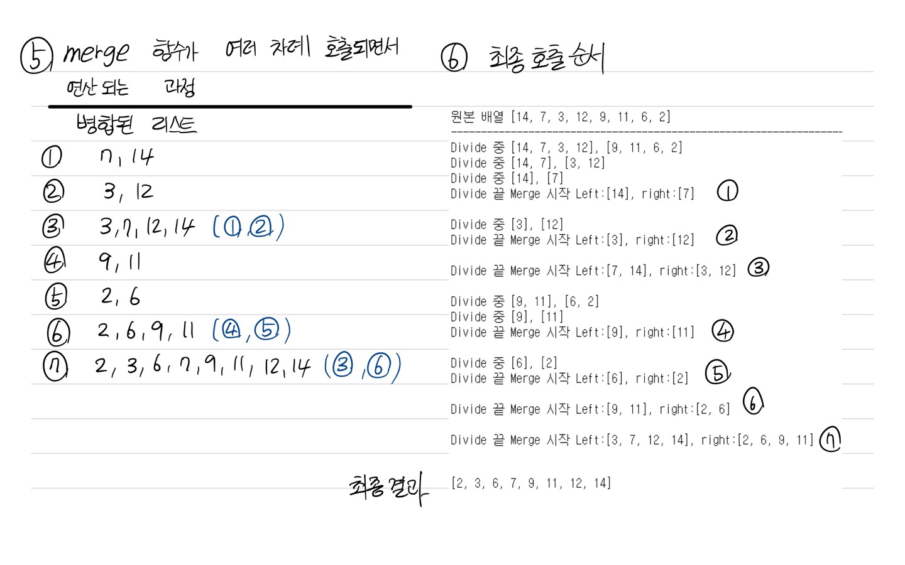
    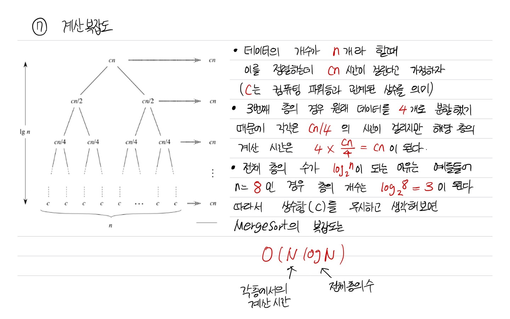
    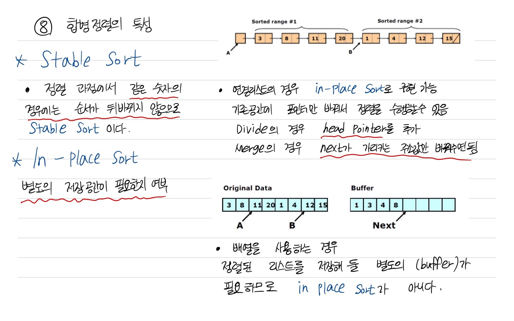
</div>
<br>

---
## Heap Sort
- [파이썬구현](sorting/heap_sort.py)
- **힙정렬**(heap sort)은 BUILD_MAX_HEAP으로 입력 배열 A, (n=length(A))를 **최대힙**(MAX HEAP)으로 먼저 만들면서 시작한다. 최대힙에서는 최대 값이 루트 A[0]에 저장되어 있으므로 이것을 A의 마지막 요소값과 교환하면 정확히 마지막 자리에 넣을 수 있다. 이제 힙에서 (A.heap_size를 줄여서) 노드 n을 제거하면 A[0, ..., (n-2)]을 최대 힙으로 만드는 것은 그리 어렵지 않다. 루트의 자식들은 최대 힙으로 남아 있지만 새로운 루트는 최대 힙 특성을 어길 수 있다. 따라서 최대 힙 특성을 다시 지키도록 **HEAPIFY**(A,0)을 호출한다. 이 알고리즘은 이 과정을 힙 크기가 n-1일 때부터 2로 줄어들 때까지 반복한다.  
- **알고리즘**
    ```
    1. n개의 노드에 대한 완전 이진 트리를 구성한다. 이때 루트 노드부터 부모노드, 왼쪽 자식노드, 오른쪽 자식노드 순으로 구성한다.
    2. 최대 힙을 구성한다. 최대 힙이란 부모노드가 자식노드보다 큰 트리를 말하는데, 단말 노드를 자식노드로 가진 부모노드부터 구성하며 아래부터 루트까지 올라오며 순차적으로 만들어 갈 수 있다.
    3. 가장 큰 수(루트에 위치)를 가장 작은 수와 교환한다.
    4. 2와 3을 반복한다.
    ```
- **복잡도**
  
  - **시간 복잡도**
    -   이진 트리를 최대 힙으로 만들기 위하여 최대 힙으로 재구성 하는 과정이 **트리의 깊이** 만큼 이루어지므로 O(log n)의 수행시간이 걸린다. 구성된 최대 힙으로 힙 정렬을 수행하는데 걸리는 전체시간은 힙 구성시간과 n개의 데이터 삭제 및 재구성 시간을 포함한다.
    힙정렬은 일반적인 경우 O(n log n)의 시간복잡도를 가진다.
        ```python
        = (log n + log (n-1) + ... + log 2)
        = (log n + log (n-1) + ... + log 2) +(log n + log (n-1) + ... + log 2)
        = (n log n)
        ```
    
  <br>

  ```python
  최악 시간복잡도	  O(n log n)
  최선 시간복잡도	 O(n log n)
  평균 시간복잡도	 O(n log n)
  공간복잡도	 O(1)
  ```

- **시각화**


  
---
<div align='center'>
    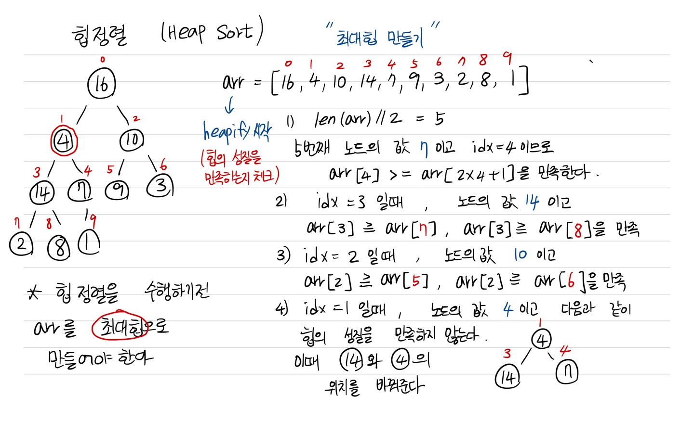
    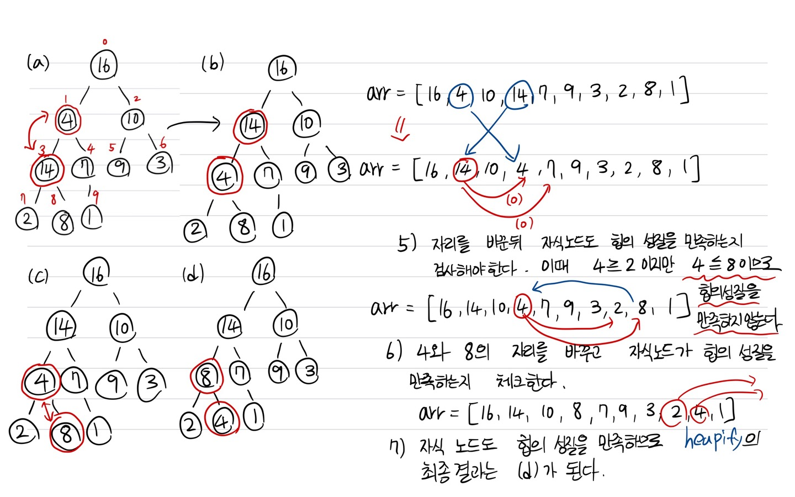
    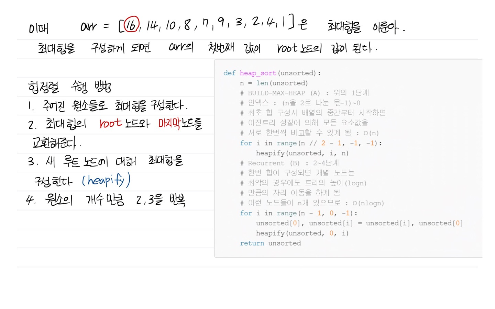
    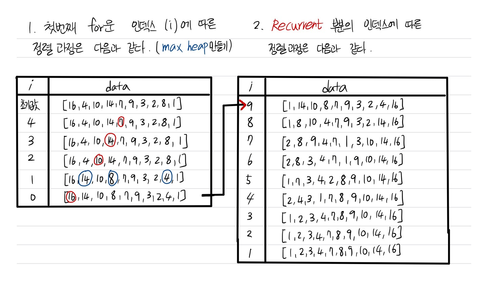
    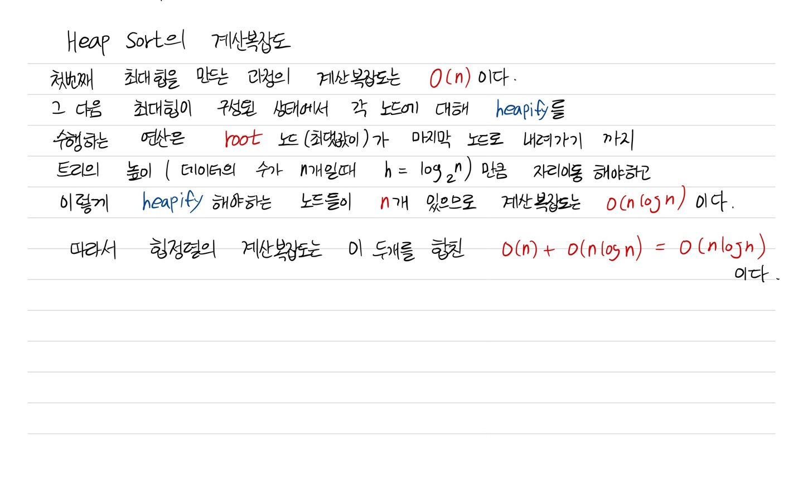
</div>
 


---
## Counting Sort
- [파이썬구현](./sorting/counting_sort.py)
- **카운팅정렬**(counting sort)은 작은 양의 정수 key에 따라 원소를 정렬하는 알고리즘이다. 즉 **integer sotring** 알고리즘이다. 알고리즘은 고유한 key값을 가지는 객체의 수를 카운팅하고 출력 시퀀스에서 각 key값의 위치를 결정하기 위해 해당 카운트에 접두사(prefix)의 합을 적용하며 동작한다. 실행시간은 원소 수와 최소 key 값과 최대 key 값의 차이가 **선형적**이기 때문에 이 차이가 원소의 수보다 크게 크지 않은 경우에 사용하기 적합하다. 이 알고리즘은 더 큰 key를 효율적으로 다룰 수 있는 또 다른 정렬 알고리즘인 **기수정렬**(radix)에서 서브루틴으로 사용된다.
- **카운팅정렬**은 **비교정렬**이 아니며 key 값을 배열의 인덱스로 사용하고 **비교정렬**에 대한 하한 Ω(n log n)이 적용되지 않는다.
- **카운팅정렬** 대신 **버킷정렬**을 사용할 수 있으며 두 알고리즘은 유사한 성능을 가진다. 그러나 카운팅정렬과 비교해서 버킷정렬은 연결된 원소, 동적 배열 또는 각 버킷 내의 원소 집합을 저장하기 위해 미리 할당된 많은 메모리가 필요한 반면, 카운팅 정렬은 하나의 숫자(원소 수)를 저장한다.
- **알고리즘**
    ```
    A: Input array, b: output array, c: count array
    1. A로 부터 배열 내의 원소 값들의 갯수를 저장하는 count 배열(c)을 만든다.
    2. count array의 요소들에 대해 직전 요소들의 값을 더해준다.
    3. A와 동일한 크기의 출력을 담을 b를 만들고 입력 배열의 역순으로 출력 배열에 요소들을 채워넣는다.   
    ```
- **복잡도**
    ```
       최악의 시간복잡도: O(n+k), k는 양의 정수
       최악의 공간복잡도: O(n+k)
    ```
  - 시간복잡도 
    - count 배열의 초기화, count 배열에서 접두사(prefix)의 수를 세는 루프의 반복은 최대 k + 1회이고 따라서 O(k)이다. 그리고 출력 배열의 초기화는 O(n) 시간이 걸리므로 전체 알고리즘의 시간은 O(n + k)이다.
  
  - 공간복잡도
    - 길이 n, k+1의 배열을 사용하므로 사용하는 총 공간은 O(n + k)이다. 원소의 수보다 최대 key값이 훨씬 작은 경우, input과 output array외에 사용하는 저장 공간은 O(k)를 사용하는 Count 배열이기 때문에 이때 계수 정렬은 상당히 공간 효율적(high space efficient)이다.
    
- **시각화**

  
  
---
<div align='center'>
    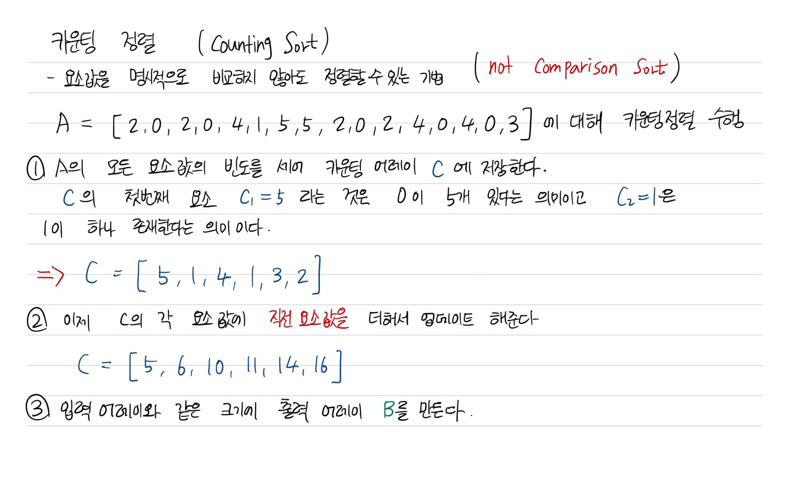
    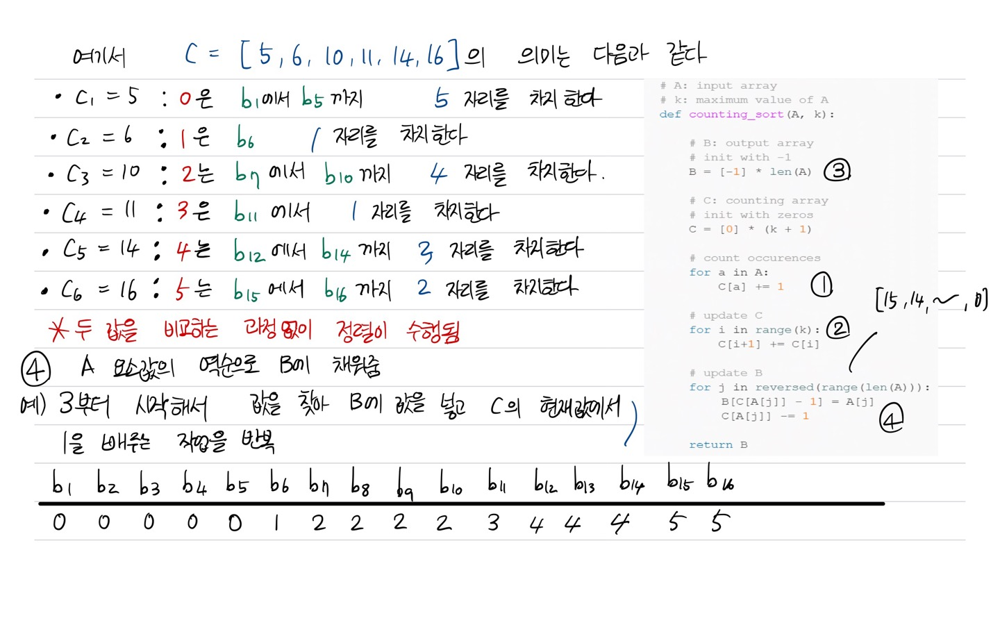
</div>

## Radix Sort
- [파이썬구현](./sorting/radix_sort.py)
- **기수정렬**(radix sort)은 기수 별로 비교 없이 수행하는 정렬 알고리즘이다. 기수로는 정수, 낱말 등 다양한 자료를 사용할 수 있으나 크기가 유한하고 **사전순**으로 정렬할 수 있어야 한다. **버킷정렬**의 일종으로 취급되기도 한다. 기수에 따라 원소를 버킷에 집어 넣기 때문에 비교 연산이 불필요하다. 기수 정렬은 정렬 방법의 특수성 때문에, 부동소수점 실수처럼 특수한 비교 연산이 필요한 데이터에는 적용할 수 없지만 적당한 도메인에서 최적화 된 기수 정렬은 매우 빠를 수 있다.
  

- **알고리즘**
    - **Pseudo Code**
      ```C
      RADIX-SORT(A,d)
      for i = 1 to d
          안정된 정렬을 사용해 배열 A를 i자리를 기준으로 정렬한다.
      ```
- **복잡도**
    -  기수에 따라 원소를 버킷에 집어 넣기 때문에 비교 연산이 불필요하다.
    -  유효숫자가 두개 이상인 경우 모든 숫자 요소에 대해 수행될 때까지 각 자리수에 대해 반복한다. 따라서 전체 시간 복잡도는 O(nk)(k는 기수의 크기)이 된다. 정수와 같은 자료의 정렬 속도가 매우 빠르다.
    -  데이터 전체 크기에 기수 테이블(도메인)의 크기만한 메모리가 더 필요하다.
      
        ```
        최악 시간복잡도: O(nk), n은 요소의 수, k는 기수의 크기
        공간복잡도: O(n+k)
        ```
    
- **시각화**

  <br>  
  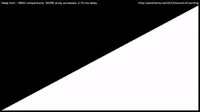  

---
<div align='center'>
    
    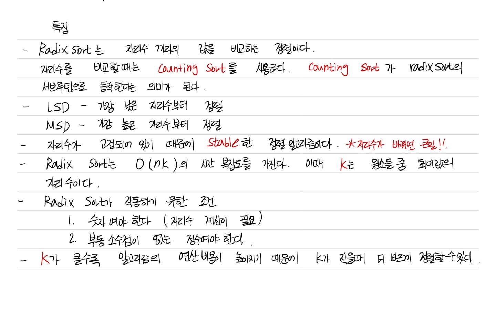
</div>


---
## Topological Sort
- [파이썬구현](./sorting/topological_sort.py)
- **위상 정렬**이란 어떤 일을 하는 순서를 찾는 알고리즘이다. **DAG**(Directed Acyclic Graph)라는 비순환 방향그래프에서 각 정점들의 선후 관계가 주어졌을 때, 이 순서를 위배하지 않으면서 방문할 수 있는 정점의 순서를 정렬하는 알고리즘으로 그래프의 유형에 따라 여러가지 정렬 방법이 나올 수 있다는 특징을 가진다.
- **특징**
  - 비순환 방향 그래프는 사이클이 존재하지 않는 방향 그래프이다.
  - 정렬의 결과로 여러가지의 위상 정렬이 존재할 수 있다.
  - 위상 정렬의 과정에서 그래프에 남아 있는 정점 중에 진입차수(in degree)가 0인 정점이 없다면 위상 정렬은 중단되고 모든 노드를 방문하지 않은 경우, 이러한 그래프는 위상 정렬로 표현이 불가능하다. 
- **알고리즘**
  
  - Pseudo Code
    ```C
    TopologicalSort(Graph G)
    {
      while(vertices of g are remain){
        v = Select vertex in-degree == 0;
        Visit(v);
        remove v;
        decrease in-degree of adjacent of v;
      }
    }
    ```
- **복잡도**
    - 위상 정렬의 일반적인 알고리즘은 꼭짓점의 양수 노드의 선형 실행 시간을 가진다. 
    -  O(|V|+|E|), V: 정점, E: 간선
    
- **응용**
  - **Apache Airflow** 는 데이터 엔지니어링 파이프라인을 위한 오픈 소스 워크플로 관리 플랫폼이다. 복잡한 회사의 워크플로를 관리하기 위한 솔루션으로 Airflow를 생성함으로써 Python 프로그래밍으로 워크플로를 작성 및 예약하고 내장된 Airflow 사용자 인터페이스 를 통해 워크플로를 모니터링할 수 있다.
  - [Apache Airflow DAGs](https://airflow.apache.org/docs/apache-airflow/stable/concepts/dags.html#the-dag-decorator)

- **시각화**

  
  
---
<div align='center'>
    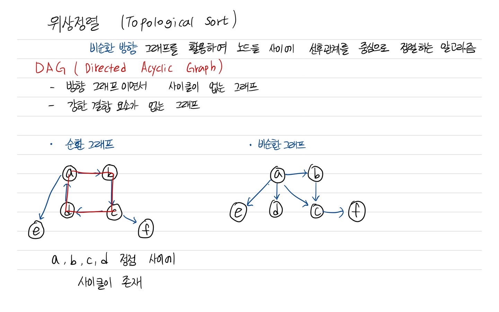
    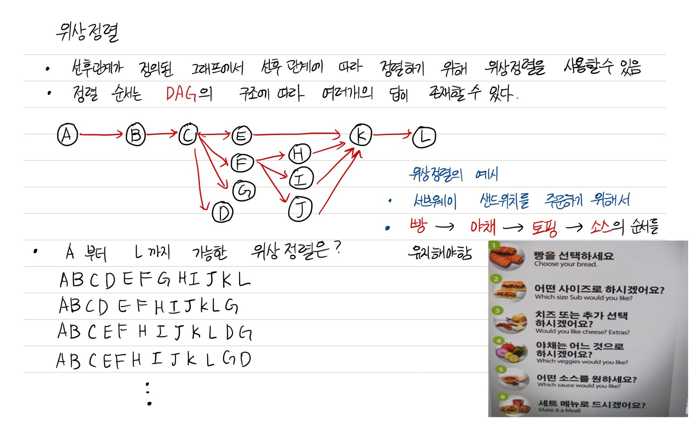
    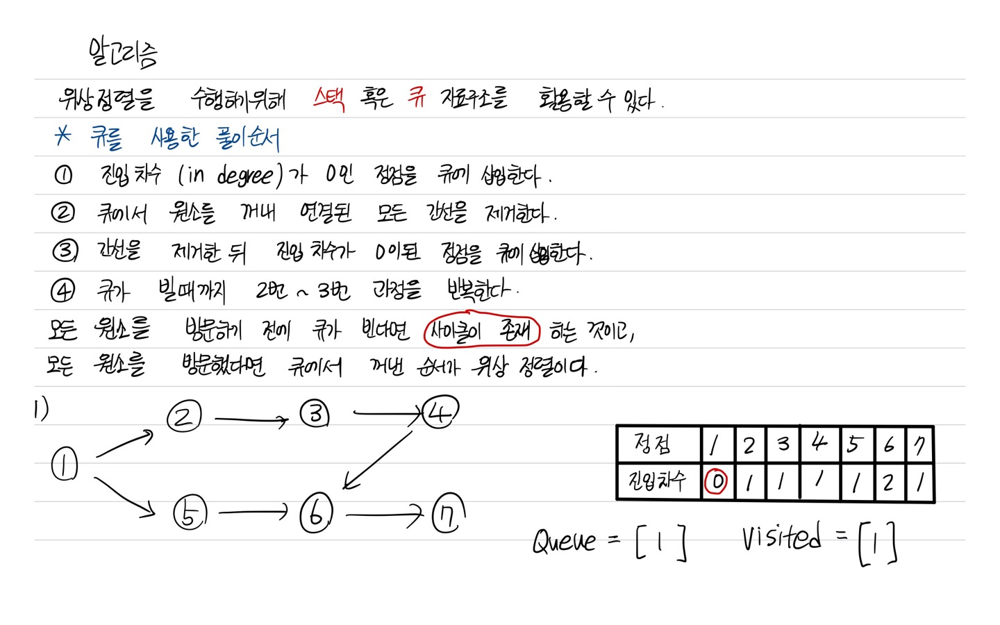
    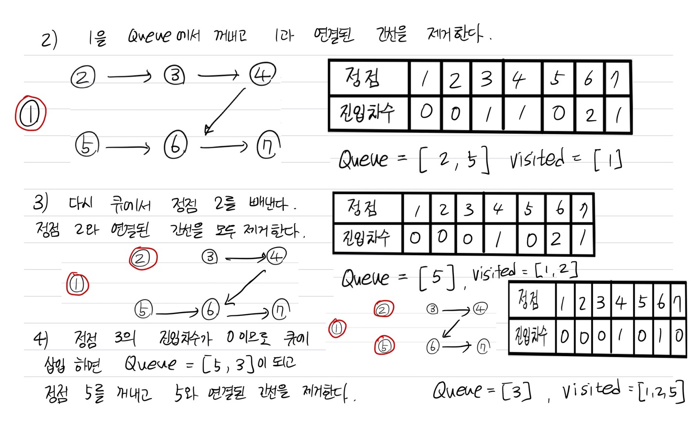
    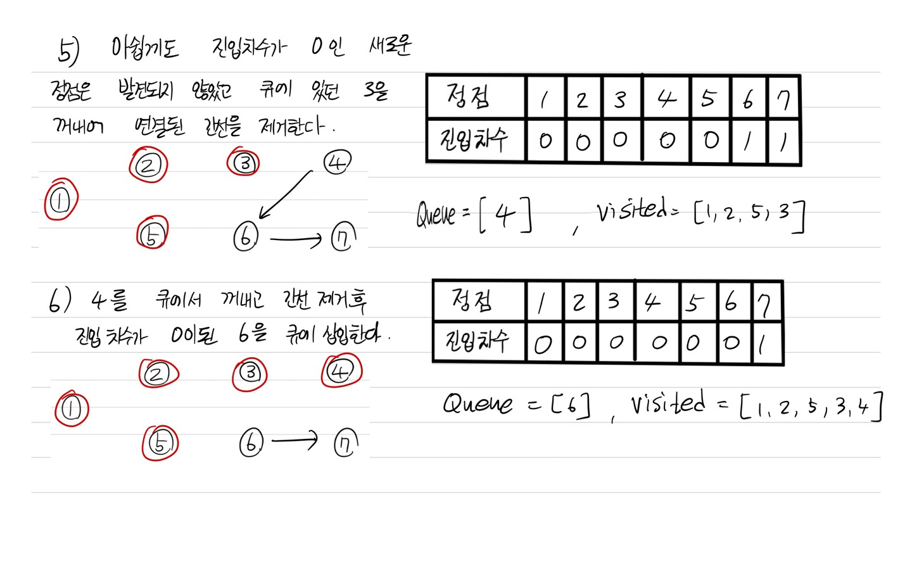
    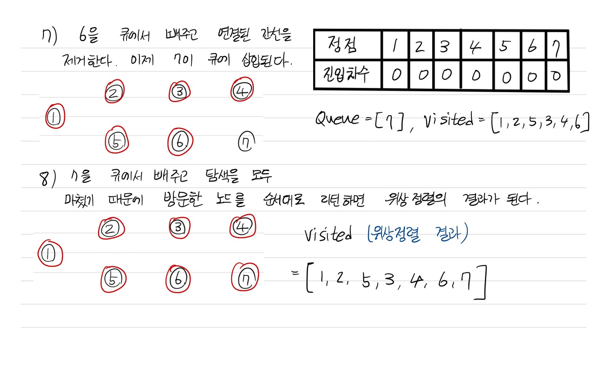
</div>

----

## Reference
- [wikipedia](https://ko.wikipedia.org/)
- [ratsgo blog](https://ratsgo.github.io/)
- [안경잡이 개발자](https://m.blog.naver.com/PostList.naver?blogId=ndb796)
- [radix sort gif](https://makeagif.com/gif/radix-sort-algorithm-w0c4-p)
