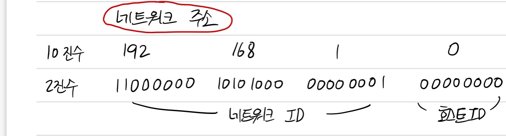
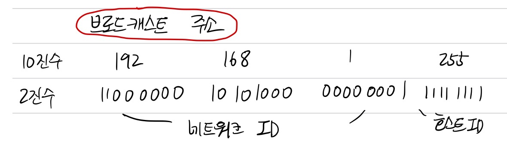
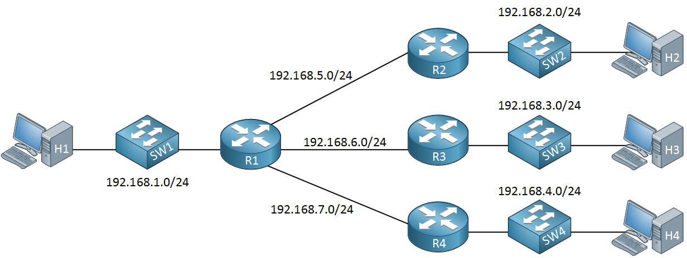

  <h1>Network</h1>

**Contents**
- [- Router](#--router)
- [IP Address](#ip-address)
- [Network/Broadcast Address](#networkbroadcast-address)
- [Subnet](#subnet)
- [Router](#router)
---
## IP Address
- IP 주소는 네트워크의 규모에 따라 A ~ E 클래스로 나누어져 있으며 일반적으로 A ~ C클래스를 사용한다.
- 네트워크 크기에 따라 32비트의 IP 주소를 네트워크 ID와 호스트 ID로 bit를 조정하여 IP 주소를 A ~ E클래스로 구분할 수 있다.
 
 

    

 
 

- A 클래스는 8비트의 네트워크 ID와 24비트의 호스트 ID로 구성된다.
- A 클래스의 1옥텟(8비트)의 범위는 2진수로 00000001 ~ 01111111이며 10진수로 변환하면 1 ~ 127이다. 2~4 옥텟의 범위는 0 ~ 255의 범위를 가지고 전체 범위는 1.0.0.0 ~ 127.255.255.255 이다. 

- B 클래스의 1 옥텟의 범위는 2진수로 10000000 ~ 10111111이고, 10진수로 변환하면 128 ~ 191이 된다. 전체 범위는 128.0.0.0 ~ 191.255.255.255가 된다.

- C 클래스의 1옥텟의 범위는 2진수로 11000000 ~ 11011111이며, 10진수로 변환하면 192~223이다. 192.0.0.0 ~ 223.255.255.255의 범위를 가진다.

 

    

 

- 사설 IP 주소는 공인 IP주소로 사용할 수 없다.
- cmd에서 `ipconfig` 명령어를 실행해서 IP 주소를 확인할 수 있다.

---
## Network/Broadcast Address

- 네트워크와 브로드캐스트 주소로 컴퓨터나 라우터가 자신의 IP로 사용하면 안된다.
 

    

 

- 네트워크 주소는 호스트 ID가 10진수로 0, 2진수 00000000인 주소이다. 

- 네트워크 주소는 전체 네트워크에서 작은 네트워크를 식별하는데 사용되고 호스트 ID가 10진수로 0이면 그 네트워크 전체를 대표하는 주소가 된다. 

- 예를들어 192.168.1.0은 네트워크 192.168.1.1 ~ 6의 IP 주소를 대표하는 네트워크 주소이다. 
 

    

 
 
- 브로드캐스트 주소는 호스트 ID가 10진수로 255고 2진수로 11111111인 주소이다.

- 브로드캐스트 주소는 네트워크에 있는 컴퓨터나 장비 모두에게 한 번에 데이터를 전송하는데 사용되는 전용 IP 주소이다.
- 전체 네트워크에 데이터를 전송하려면 호스트 ID에 255를 설정하면 된다.
- 192.168.1.255의 브로드 캐스트로 데이터를 전송하면 네트워크 안에 있는 모든 컴퓨터가 데이터를 전달 받게 된다.
- 네트워크 주소와 브로드캐스트 주소는 컴퓨터에 설정할 수 없다.

---

## Subnet

- 브로드캐스트로 데이터를 전송하면 수 많은 컴퓨터로 브로드캐스트 패킷이 전송되어 네트워크가 혼잡해질 수 있는데 대규모의 네트워크를 작은 네트워크로 분할하여 브로드캐스트로 전송되는 패킷의 범위를 좁힐 수 있어 IP 주소를 더 효과적으로 활용할 수 있다.

- 네트워크를 분할하는 것을 서브넷팅이라 하고, 분할된 네트워크를 서브넷이라고 한다.

 

    

 

- A 클래스의 경우 네트워크 ID가 8비트 호스트 ID가 24비트로 구성되고 서브넷팅할 경우 네트워크 ID, 서브넷ID, 호스트ID로 나눠진다. 서브넷 ID는 호스트 ID에서 비트를 빌려 생성된다.

 

*서브넷마스크란?*

- IP 주소를 서브넷팅하면 네트워크 ID와 호스트 ID를 구분하기 어려운데 이때 서브넷마스크를 사용할 수 있다.
- 서브넷 마스크는 네트워크 ID와 호스트 ID를 식별하기 위한 값이다. 
<<<<<<< HEAD
- *프리픽스(prefix)* 표기법
    - 서브넷 마스크를 슬래스(/비트 수)로 나타낸 것을 말한다.
    - ex) 255.255.255.0은 /24가 된다.
  
 

    

 
 
---

## Router
- 서로 다른 네트워크를 연결해주는 장치로 현재 네트워크에서 다른 네트워크로 패킷을 전송할 수 있도록 한다.
  
- 라우터는 네트워크를 분할할 수 있지만 스위치와 허브는 분할할 수 없다. 
- 컴퓨터가 다른 네트워크에 데이터를 전송하려면 라우터의 IP 주소를 설정해야 하는데 이것은 네트워크의 출입구를 설정하는 것으로 **기본 게이트웨이**라고 한다.

 

    

 

  
- 위의 오른쪽 그림에서 첫번째 PC는 192.168.1.0/24 네트워크에 속해 있기 떄문에 라우터의 IP 주소인 192.168.1.1로 설정한 것이다.

*라우팅*

- 라우팅은 경로 정보를 기반으로 현재의 네트워크에서 다른 네트워크로 최적의 경로를 통해 데이터를 전송하는 방법이다.
- 각 라우터의 라우팅 테이블에 경로 정보가 등록되어 있다.
- 소규모 네트워크의 경우 **수동**으로 라우팅 테이블을 등록하는 것이 적합하고 대규모 네트워크는 **자동**등록이 적합하다. 대규모 네트워크에는 정보를 하나하나 라우터에 등록하기가 힘들며 등록된 내용이 수정되면 수동으로 변경해야 하므로 작업량이 많아지기 때문이다.
- 라우터 간에 경로 정보를 서로 교환하여 라우팅 테이블 정보를 자동으로 수정할 수 있다.
- 라우터 간에 정보를 교환하기 위한 프로토콜을 **라우팅 프로토콜**이라 한다.
    - 대표적인 라우팅 프로토콜로 RIP, OSPF, BGP 등이 있다.
- 네트워크 관리자가 수동으로 정보를 등록할 수 있다. 

---
=======
- 
