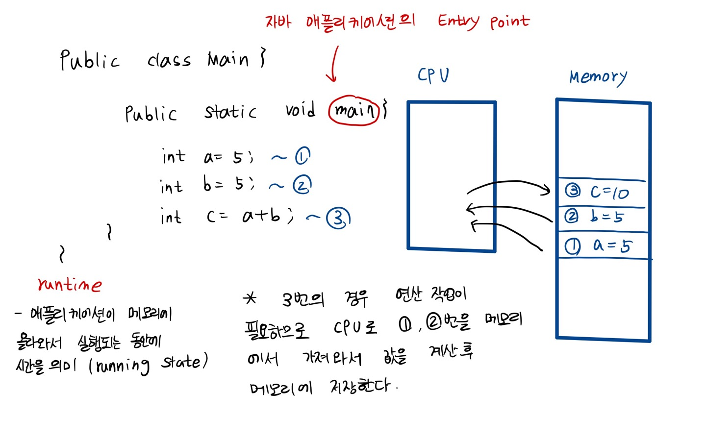
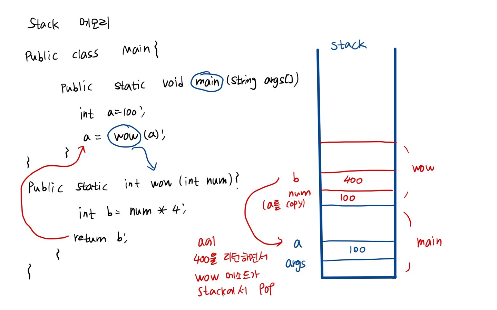
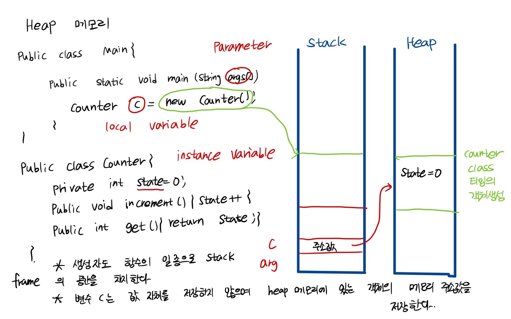
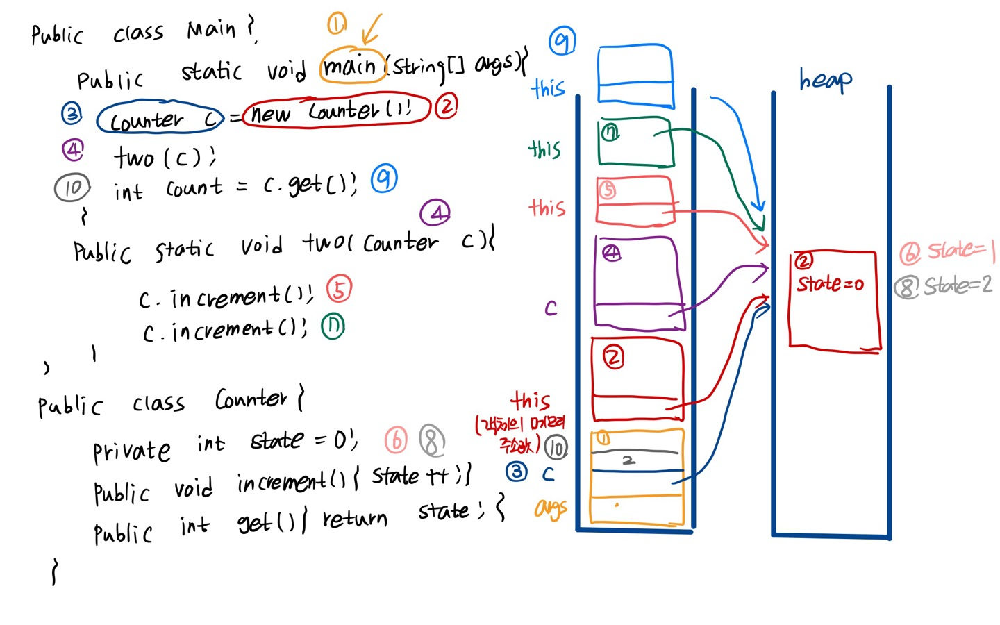
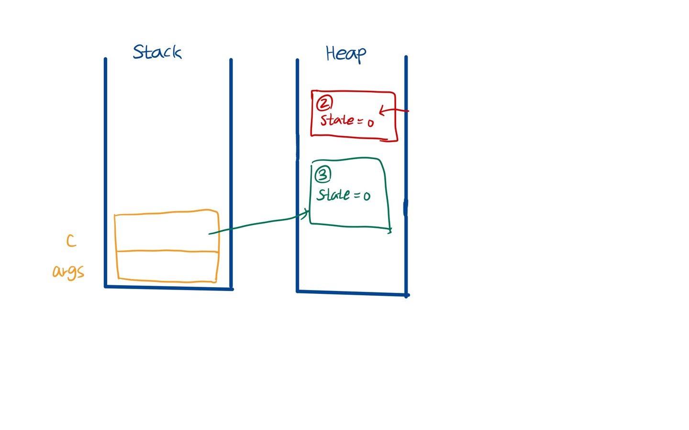
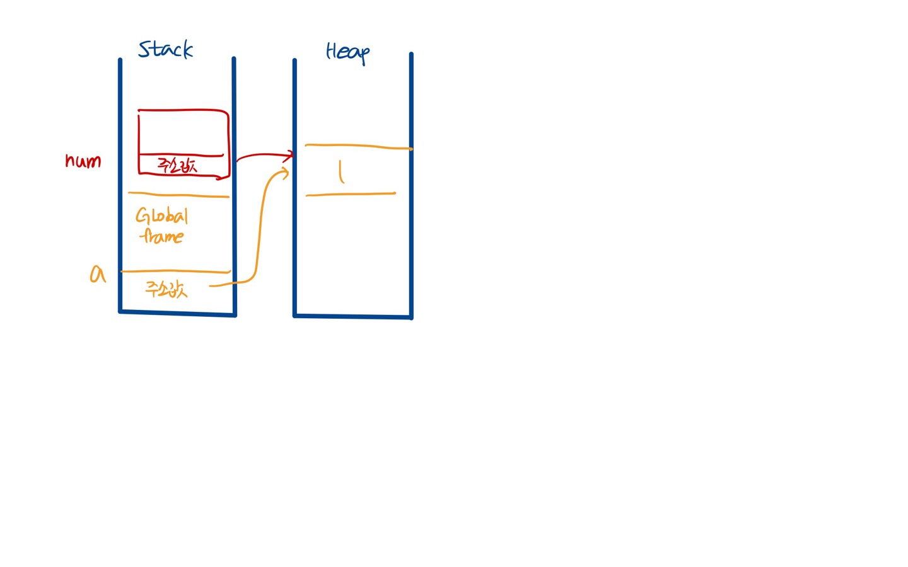

<div align='center'>
  <h1>Operating System</h1>
</div>


**Contents**
- [변수, 객체와 메모리의 관계](#Q1)

---

### Q1

**변수, 객체와 메모리의 관계**

- 프로그램을 실행했을 때 변수와 객체가 메모리에 어떻게 저장되는지 이해하자.
- 프로그램이 실행될 때 객체를 포함하여 데이터가 메모리에 어떻게 저장되는지 알아야 개발 중에 실수하지 않을 수 있고 애플리케이션 성능과 어떻게 연관있는지 이해할 수 있다.
- `프로그램` : 일반 사용자가 사용할 기능을 제공하는, 컴퓨터가 실행할 수 있는 명령어들의 집합
- `메모리` : 실행된 프로그램이 상주하는 곳
- `CPU` :  명령어를 실행하는 주체
- `참조 변수(reference variable) `

    객체의 메모리 주소 값을 저장하는 변수

    ex) Counter c = new Counter();    


- `기본형 변수(primitive variable)`

     - 기본형 타입의 값 자체를 저장하는 변수 

    - 자바의 경우 byte, short, int, long, float, double, char, boolean 타입의 변수

        ex) int a = 10;
    
    
---

**RUNTIME 환경에서 메모리의 모습**

- 애플리케이션에 할당되는 메모리는 내부적으로 여러 영역으로 나뉜다.
- 그 중 `stack` 메모리와 `heap` 메모리가 있다.

`runtime`
- 애플리케이션이 메모리에 올라와서 실행되는 시간 (running state)

`stack memory` 
-  함수나 메서드의 지역변수와 매개변수가 저장된다. 함수나 메서드가 호출될 때마다 스택 프레임이 쌓인다.

`heap memory`
- 모든 객체가 저장되는 공간.
- 호출되는 함수나 메서드가 파라미터로 객체를 전달 받아서 그 객체의 상태를 바꾸게 됐다면 그 함수나 메소드 종료 이후에도 그 객체의 변경된 상태 그대로 남아있다

ex1)
```java
public class Main{
    public static void main(string[] args){
        int a = 5;
        int b = 5;
        int c = a + b;
    }
}

```

<div align='center'>
    
</div>
<div align='center'>
    
</div>

ex2)
```java
public class Main{
    public static void main(String[] args){
        int a = 100;
        a = wow(a);
    }
}

public static int wow(int num){
    int b = num * 4;
    return b;
}

```
<div align='center'>
    
</div>


ex3)

```java
public class Main{
    public static void main(string[] args){
        Counter c = new Counter();
    }
}


public class Counter{
    private int state = 0;
    public void increment(){ state++; }
    public int get(){return state;}
}
```

<div align='center'>
    
</div>

- 생성자도 함수의 일종이므로 stack frame으로 stack에 저장된다.
- 변수 c는 값 자체를 저장하지 않으며 heap 메모리에 있는 객체의 메모리 주소값을 저장한다.

ex4)
```java
public class Main{
    public static void main(string[] args){
        Counter c = new Counter();
        two(c);
        int count = c.get();
    }
    public static void two(Counter c){
        c.increment();
        c.increment();
    }
}

public class Counter{
    private int state = 0;
    public void increment(){ state++; }
    public int get(){ return state; }
}

```

<div align='center'>
    
</div>


ex5)

```java

// Garbage object

public class Main{
    public static void main(String[] args){  //  ~(1)
        Counter c = make();  
    }
    public static Counter make(){
        Counter c = new Counter(); // ~(2) 참조하는 변수가 없어서 heap 메모리에서 불필요하게 존재하는 객체 
        return new Counter(); // ~(3) c 변수가 참조하는 객체
    }
}

public class Counter{
    private int state = 0;
    public void increment() { state++; }
    public int get() { return state; }
}
```

<div align='center'>
    
</div>


**쓰레기 객체를 어떻게 처리할 수 있을까?**

- 프로그래밍 명령어로 객체에 할당된 메모리 공간을 직접 해제하는 경우
- 자바, 파이썬등의 언어 레벨에서 쓰레기 객체를 알아서 처리해주는 GC가 존재하는 경우


**파이썬은 모든 것이 객체이다.**

```python
def wow(num):
    print(num)

a = 1 // ~(1) heap 메모리에 객체가 생성되고 a에 1이 저장된 객체의 주소값이 저장된다.
wow(a) // ~(2)  

```

<div align='center'>
    
</div>

### Q2
